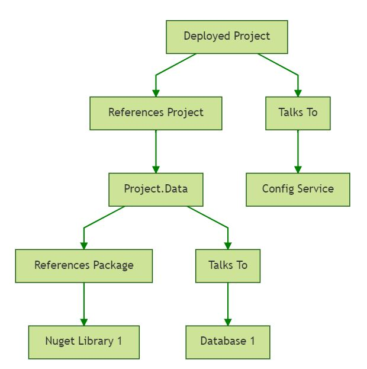

It's common for software companies to have many deployed services that communicate with each other and connect to databases over the network. Each service can consist of one or more code projects that can reference other projects and code libraries. Code projects can be written in different programming languages running on a common runtime.

In the .Net landscape projects can be written in C#, VB.Net and F# and run on one of two runtimes, either .Net Framework (`netframework`) or dotnet core (`netcore`). Projects can reference two types of libraries, .Net Framework (`netXXX`) or .Net Standard (`netstandardXX`) which can be packaged via `Nuget` or as a part of the runtime.

I participated in a company hackathon just before christmas with the intention of exploring the relationships between the ~50 deployed services, code projects and databases in the platform. The projects are written in either C# or VB.Net and run on either `netframework` or `netcore`. The projects reference external nuget libraries that can be built for either `netstandardXX` or `netXXX`. 

Dependent relationships can be modelled nicely by a graph data structure, with the projects, databases and libraries being the nodes with defined relationships joining them.
Neo4j is a popular graph database that can be used to create and query a graph structure of the projects.





### Modeling project data with F#

The ProjectAnalyser F# console application is going to parse the project and config files into nodes and relationships. 

To perform this task it is useful to define the domain. The project nodes can be modelled with:

``` fsharp
type ProjectType = NotKnown | NetFramework | NetCore
type CodeProject = CodeProject of name:string * ProjectType

type DeployedProject = DeployedProject of name:string

type ProjectNode = 
  | Code     of CodeProject
  | Deployed of DeployedProject
```

The type `CodeProject` wraps a tuple of a `string` labelled `name` and a `ProjectType` which can be either `NetFramework`, `NetCore` or `NotKnown` at that point in the application. The `DeployedProject` type wraps a name and the `ProjectNode` can be one of either project types.

The Libraries can be modelled with:

``` fsharp
type NugetPackageType = Unknown | Framework | Standard
type NugetLib =         NugetLib of name:string * version:string * NugetPackageType

type RuntimeLib = RuntimeLib of name:string

type LibraryNode =
  | Nuget of NugetLib
  | Runtime of RuntimeLib
```

    


### Project and library info

The project, library nodes and `REFERENCES` relationships can be derived from the code project files. These are xml files which contain information on the project references and the libraries used in the project. Project files take slightly different forms depending on whether they are `netframework` or `netcore` but they contain three types of nodes which are interesting. 

  Platform      |   Node name        |   Contains
  --------      |   ---------        |   --------
  netframework  |  ProjectReference  |  References between projects
  netframework  |  Reference         |  A nuget or framework library reference
  netcore       |  ProjectReference  |  References between projects
  netcore       |  PackageReference  |  A nuget or framework library reference
  
An example of the relevant nodes of a netframework project file `SomeProject.csproj` can be seen below:

``` xml
<?xml version="1.0" encoding="utf-8"?>
<Project xmlns="http://schemas.microsoft.com/developer/msbuild/2003">
  <ItemGroup>
    <!-- Nuget library reference -->
    <Reference Include="Newtonsoft.Json, Version=12.0.0.0, Culture=neutral, PublicKeyToken=30ad4fe6b2a6aeed, processorArchitecture=MSIL">
      <HintPath>..\packages\Newtonsoft.Json.12.0.2\lib\net45\Newtonsoft.Json.dll</HintPath>
    </Reference>
    
    <!-- Framework library reference -->
    <Reference Include="System.Net.Http" />
  </ItemGroup>
  
  <ItemGroup>
    <!-- Project reference to other code project -->
    <ProjectReference Include="..\Other.Project\Other.Project.csproj">
      <Project>{560411b0-4899-48d8-9dd1-662874c17f73}</Project>
      <Name>Other.Project</Name>
    </ProjectReference>
  </ItemGroup>
</Project>
```

From this file we can derive the following nodes and relationships:


### Project and database relationships

The project, database and `CAN_TALK_TO` relationships can be 

