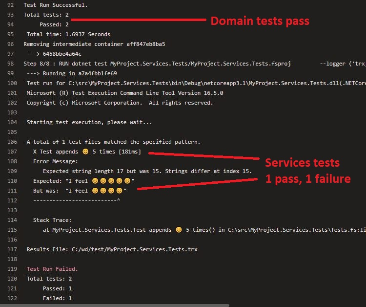
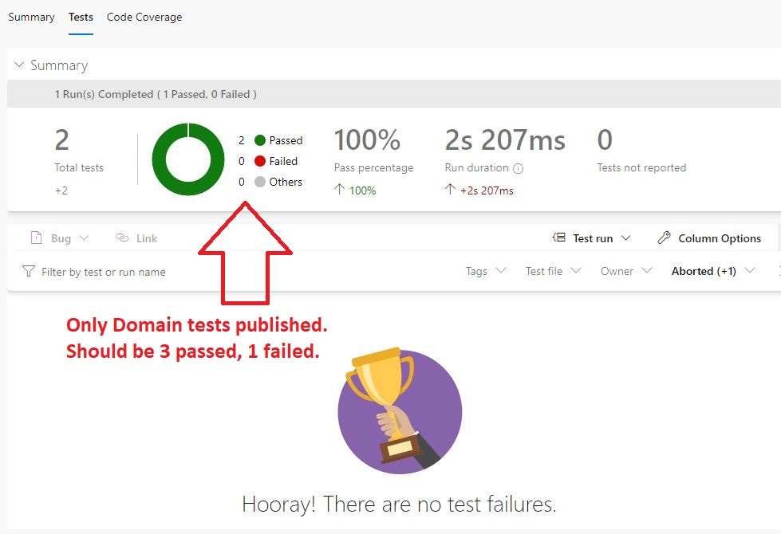

> This post details a solution to a problem encountered when running tests in docker that I haven't seen documented anywhere else.

## TLDR;

Running `dotnet test` will return an exit code 1 if the tests fail. If this occurs in a `Dockerfile` it will cause the docker image layer to not be created and the test output file to be irretrievable.

A workaround is to save some state (a text file) that indicates that the test run failed and then check for this in the final step of the `Dockerfile`. This means that the test output files can be retrieved from the image layer that ran the tests and published to the pipeline. 


## Full post...

Modern software development practices include a continuous integration pipeline that builds and verifies the correctness of software by running automated tests. Docker can be used to run `dotnet` commands to build, test and package applications in a reliable way.

`dotnet test` can write it's output to a text file to detail each test's result, this can be useful to keep track of test metrics over time and to find tests that fail often. 

### The setup

Like most [~~C#~~](https://twitter.com/DotNetIsCSharp) dotnet developers, I use multiple projects to deal with different application concerns. The application `MyProject` will have projects for the domain and services code (`MyProject.Domain` and `MyProject.Services`) where the project reference dependencies are:

```
           --> MyProject.Services ->
MyProject /                         \
          \----------------------------> MyProject.Domain
```

The services and domain projects have their own test libraries (`MyProject.Domain.Tests` and `MyProject.Services.Tests`) that I want to run during the build. If any tests fail I want the build to fail and the results file to find out the details.


The domain library has a type to wrap a string called `Emoji` and an `emojiFrom` function that takes an `input` `string` of `:)` or `:(`  and returns an `Emoji` that wraps `😊` or `😢` or throws an `ArgumentException`.  

[It](https://www.youtube.com/watch?v=US8QG9I1XW0) makes [sense](https://twitter.com/bomret/status/1244535855416512512) to [write](https://blog.scottlogic.com/2018/06/01/magical-domain-modelling-with-fsharp.html) the [domain](https://www.youtube.com/watch?v=PLFl95c-IiU) project in [F#](https://www.youtube.com/watch?v=UXeFR5RQnjs) and the implementation can be seen:

``` fsharp
module MyProject.Domain
    
open System

type Emoji = Emoji of string

let emojiFrom input =
    if input = ":)" then
        Emoji "😊"
    elif input = ":(" then
        Emoji "😢"
    else
        raise (ArgumentException("input needs to be either :) or :("))
```

The `MyProject.Domain.Tests` project contains NUnit tests that verify the `emojiFrom` function. It's important to use F# for test projects because it allows any characters to be used as test names with double back-ticks, so it's possible to accurately describe the behaviour 😊.

``` fsharp
module MyProject.Domain.Tests

open NUnit.Framework
open MyProject.Domain

[<Test>]
let ``emojiFrom creates 😊 emoji from :)`` () =
    let expected = Emoji "😊"
    
    let result = emojiFrom ":)"
    
    Assert.AreEqual (expected, result)

[<Test>]
let ``emojiFrom creates 😢 emoji from :(`` () =
    let expected = Emoji "😢" 
    
    let result = emojiFrom ":("
    
    Assert.AreEqual (expected, result)
```

The services code contains an `EmojiAppender` service to append `Emoji` types onto strings:

``` csharp
using static MyProject.Domain;

namespace MyProject.Services
{
    public class EmojiAppender
    {
        public string AppendNTimes(string str, Emoji emoji, int n)
        {
            var returnVal = str;
            for (int i = 1; i < n; i++)
            {
                returnVal += emoji.Item;
            }

            return returnVal;
        }
    }
}
```

The string value of the `Emoji` type is retrieved by the `Item` property and added to the provided string `str`. `MyProject.Services.Tests` tests this:

``` fsharp
module MyProject.Services.Tests

open NUnit.Framework
open MyProject.Domain
open MyProject.Services

[<Test>]
let ``Test appends 😊 0 times`` () =
    let appender = EmojiAppender()
    let happy = Emoji(":)")

    let result = appender.AppendNTimes("I feel ", happy, 0)
    
    Assert.AreEqual("I feel ", result)

[<Test>]
let ``Test appends 😊 5 times`` () =
    let appender = EmojiAppender()
    let happy = Emoji(":)")

    let result = appender.AppendNTimes("I feel ", happy, 5)
    
    Assert.AreEqual("I feel 😊😊😊😊😊", result)
```

The service contains an "off-by-one" error from the incorrect initialisation of the loop, so the second test should only append 😊 four times and fail.

### Docker-ing

A basic `Dockerfile` to build and run the tests can be achieved with:

``` docker
FROM mcr.microsoft.com/dotnet/core/sdk:3.1

ARG TESTDIR=

SHELL ["pwsh", "-command"]

RUN mkdir $env:TESTDIR

WORKDIR /src

COPY . .

RUN dotnet test MyProject.Domain.Tests/MyProject.Domain.Tests.fsproj \
        --logger ('trx;LogFileName={0}/MyProject.Domain.Tests.trx' -f $env:TESTDIR)

RUN dotnet test MyProject.Services.Tests/MyProject.Services.Tests.fsproj \
        --logger ('trx;LogFileName={0}/MyProject.Services.Tests.trx' -f $env:TESTDIR)
```

The `Dockerfile` takes an `ARG` of `TESTDIR` which it then creates in the container. 
It `COPY`s the contents of the repo into the `/src` folder in the container it then runs `dotnet test` for each test project which builds and runs the tests and saves the results to `trx` files in the `TESTDIR`.

The trx files can be copied out of the directory in the container by using `docker run` on the last image layer produced by the `Dockerfile` and copying the files from the `TESTDIR` directory to a "publish" directory in the container, that is mounted to the host machine.

Powershell to run and perform the test file copy is as follows:

``` powershell
$containerTestDir = "C:/wd/test"
docker build --build-arg TESTDIR=$containerTestDir .

$testResultsDirectory = "C:/temp"
$containerPublishDir = "C:/wd/publish"

$lastImageId = docker images -q | select -first 1

docker run --rm --mount type=bind,src=$testResultsDirectory,dst=$containerPublishDir `
    $lastImageId `
    pwsh -command cp ('{0}/*' -f $containerTestDir) $containerPublishDir

# trx files now available on host machine at $testResultsDirectory
```

## The problem

`docker` runs each `RUN` command and will only create a layer if the exit code of the command is 0. The test files are only accessible if the image layer has been created and this will not be possible if any of the tests fail.

When the above is run in an Azure Devops pipeline the first two tests will pass and the `MyProject.Domain.Tests.trx` file will be created but the Services tests will fail and the `MyProject.Services.Tests.trx` won't be created and publishing the test files will only show the tests from the first file.





## A solution

The `Dockerfile` needs to record if the `dotnet test` invocation returns a non-zero exit code, but not fail the docker build until all of the tests have been run. The easiest method of recording this state is to create a blank file whose existence can be checked at the end of the build.

The above logic needs to applied to each test and can be achieved with the following powershell:

``` powershell
function RunTestProj($absPath){
    $name = $absPath.Replace('\ '.Replace(' ', ''), '_').Replace('.', '_')
    write-host ('Running dotnet test for {0} -> {1}' -f $absPath, $name)
    dotnet test $absPath --logger ('trx;LogFileName={0}/{1}.trx' -f $env:TESTDIR, $name)
    if($LASTEXITCODE -ne 0){
        out-file -filepath ('{0}/failed' -f $env:TESTDIR)
    }
}
gci -Recurse **/*Tests.*proj |% { 
    RunTestProj (resolve-path -relative $_.FullName)
}
```

This finds all of the project files (.cs|.fs|.vb)proj and passes each one into a `RunTestProj` function that calls `dotnet test` with a suitable results file name. If any of the tests fail it will write out a blank file to the `$env:TESTDIR` directory called `failed`.

This file can be check for in the last line of the docker file with:

``` docker
RUN if(test-path ('{0}/failed' -f $env:TESTDIR)){ exit 1 }
```

The complete `Dockerfile` becomes:

``` docker
FROM mcr.microsoft.com/dotnet/core/sdk:3.1
ARG TESTDIR=
SHELL ["pwsh", "-command"]
RUN mkdir $env:TESTDIR
WORKDIR /src
COPY . .
RUN \
    function RunTestProj($absPath){                                             \
        $name = $absPath.Replace('\ '.Replace(' ', ''), '_').Replace('.', '_'); \
        write-host ('Running dotnet test for {0} -> {1}' -f $absPath, $name);   \
        dotnet test $absPath                                                    \
          --logger ('trx;LogFileName={0}/{1}.trx' -f $env:TESTDIR, $name) ;     \
        if($LASTEXITCODE -ne 0){                                                \
            out-file -filepath ('{0}/failed' -f $env:TESTDIR) ;                 \
        } ;                                                                     \
    }                                                                           \
    gci -Recurse **/*Tests.*proj |% {                                           \ 
        RunTestProj (resolve-path -relative $_.FullName)                        \
    }
RUN if(test-path ('{0}/failed' -f $env:TESTDIR)){ exit 1 }
```

## Conclusion

There are arguments against running tests in the build stage of docker based pipelines, but hopefully this tip can help if you find yourself needing to do it.

The code and examples of Azure Devops pipeline files can be found [on my github](https://github.com/chestercodes/docknet-test)