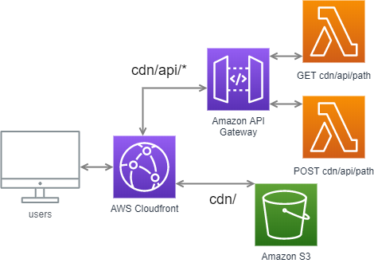
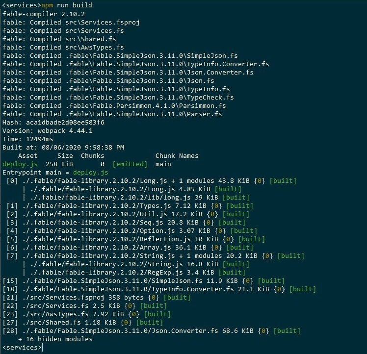
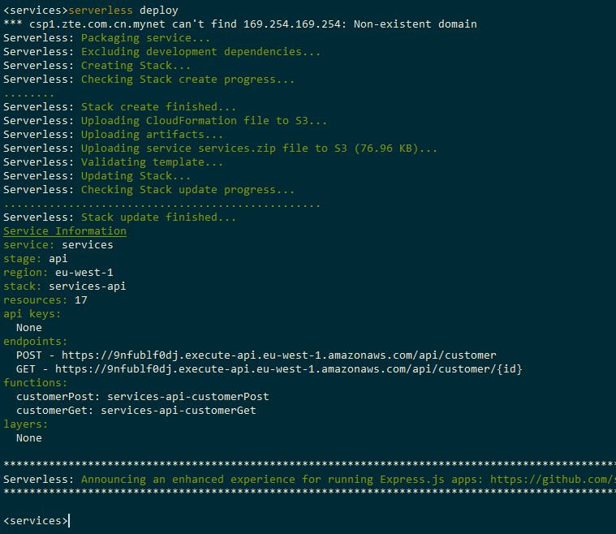

I've been using some (f)un-employment time to remind and upskill my knowledge of AWS. I've also wanted to try out the `serverless` framework to build apps using AWS Lambda functions with F# via fable.

---

## Err... what?

**AWS Lambda** [is a "functions as a service" technology](https://aws.amazon.com/lambda/) that enables building "serverless" applications. "serverless" applications have a lot of the deployment and running considerations abstracted away. They are useful for apps that need to scale on demand and that may not be used often. 

AWS Lambda functions can be written in a variety of languages/runtimes including Java, Node.js, .Net Core and Python.

**The serverless framework** [is a set of tools](https://www.serverless.com/) that allow "serverless" applications to be developed and deployed easily. 

The main feature is the `serverless` cli which consumes YAML config files and can generate the code needed to deploy the resources required for the application.

The `serverless` cli has a number of common use-cases built into the tool and can be extended with javascript plugins from the `npm` repository.


**fable** is [a compiler that can transpile F# code to Javascript](https://github.com/fable-compiler/Fable), which allows F# code to be run on the same platforms as Javascript code. 

fable works at the language level and passes the F# abstract syntax tree to the [babel](https://babeljs.io/) compiler which can output Javascript.

I want to use fable to create lambdas that run the node.js runtime rather than the `dotnet`one. It also allows the front-end application to be written in F# and converted to Javascript.

---

## Err... why?

There are a few advantages of trying this approach:

**cost** - serverless applications don't have some of the same up front costs as other methods of deploying apps using a "best-practice" approach. A zero-to-low traffic severless app will likely fall into the free-tier for most cloud provider services.


**client-server code sharing** - fable allows the same strongly-typed code to be run on the back-end and front-end. This is currently possible with typescript, but i'm a bigger fan of the F# type-system. 

This means that dtos, validation logic and domain types can be shared which potentially removes some kinds of bugs and speeds up development time. 

**Runtime** - Targeting the node.js runtime allows access to a formidable amount of third-party libraries on the `npm` repository. This is especially useful for AWS libraries where the .Net client libraries can lag behind the node.js version.

Another big advantage is that [the "cold start" time for node.js is lower](https://mikhail.io/serverless/coldstarts/aws/) than for `dotnet`. It's not a huge difference, but these start times can compound if there is a change of lambda calls.

---

## Architecture

The app consists of a static SPA site, stored on AWS S3, that is hosted with the AWS Cloudfront CDN. 

The back-end consists of a collection of AWS Lambda functions that form a REST API with the addition of an AWS API Gateway. 
The application sends requests to the gateway by customising the CDN's behaviour to direct calls to the `<CDNBase>/api/<path>` to the gateway.



---

## Api

### Shared code

A big advantage as described above is the possibility to share code across the front and backend code bases. In this case a file called `Shared.fs` is used in both and it contains a couple of simple DTOs to create and receive a customer:

``` fsharp
module Shared

module Dtos =    
    type CustomerCreate = { Name: string; Age: int; }
    type Customer =       { Name: string; Age: int; Id: int; }
```

### Functions

The Api consists of two AWS Lambda functions, `customerGet` and `customerPost`, written in F# and transpiled to Javascript.

Functions invoked by AWS Lambda need to have two arguments, these are often called  `event` and `context`.

`event` - contains information about the trigger of the function, in this case data relating to the API Gateway and REST call details. 

`context` - contains information on the context of the call, which includes AWS specific context like resource and user identifiers. Context also provides the methods required to respond to the API Gateway call. The API Gateway expects an object to be passed to the `context.succeed` method that contains information on the response `statusCode`, `headers` and `body`.

The `event` and `context` objects need describing types to be defined for them to be used with fable. These can be derived by deploying empty functions and using `console.log` to work out the property names and types. In the solution these types form an `AwsTypes` module.

The code to create a response for API gateway can be seen with:

``` fsharp
open Fable.Core.JsInterop
open Fable.Core.JS
open AwsTypes

let apiGatewayResponse code body =
    {
        isBase64Encoded = false
        statusCode = code
        headers = createEmpty
        body = JSON.stringify body
    }

let ok body = apiGatewayResponse 200 body
let notFound = apiGatewayResponse 404 ""
let badRequest body = apiGatewayResponse 400 body
```

This specifies methods of returning the common api responses `ok`, `notFound` and `badRequest` with the appropriate status codes and arguments for response body where appropriate.

The `customerPost` function shows a fake implementation of a `POST` method as a Lambda function. The required arguments are shown with the types `ApiGatewayEvent` and `AwsLambdaContext`. 

The `event.body` contains the POST request body of type `CustomerCreate` which can be deserialised using the `Fable.SimpleJson` library. 
If the `body` can be parsed then the function returns a `Customer` with an `ok` response, otherwise it creates a `badRequest` with the error. The response needs to be passed to `context.succeed` for API Gateway to return the response.

``` fsharp
open Fable.SimpleJson
open Shared.Dtos

let customerPost ((event: ApiGatewayEvent), (context: AwsLambdaContext)) =
    match event.body |> Json.tryParseAs<CustomerCreate> with
    | Ok dto -> 
        // act as if this is saved somewhere and return a Customer.
        ok { Id = 234; Name = dto.Name; Age = dto.Age; }
    | Error error -> badRequest error
    |> context.succeed
```

The `customerGet` function fakes a function to find and return customers. The function retrieves the `id` from the `event.pathParameters` object and either returns the `Customer` in an `ok` (if the Id is 123) or returns a `notFound` response.

``` fsharp
open Fable.Core.DynamicExtensions

let getId pathParameters = pathParameters.["id"].ToString()

let tryFindCustomer id =
    // pretending as if this is retrieving from a database or similar
    match id with
    | "123" -> Some { Id = 123; Name = "John"; Age = 30; }
    | _ -> None

let tryGetCustomer = getId >> tryFindCustomer
    
let customerGet ((event: ApiGatewayEvent), (context: AwsLambdaContext)) =    
    match tryGetCustomer event.pathParameters with
    | Some customer -> ok customer
    | None          -> notFound
    |> context.succeed
```

### Fable config

`fable` is called and configured using `webpack`. It needs to know the location of the `.fs` files to compile and the config for the resultant Javascript bundle.

The `.fs` files that contain the above code are specified in a `.fsproj` project file, along with the nuget dependencies. 

The webpack build needs some `fable` and `babel` related npm packages to be run which can be restored from a package.json file.

The webpack config file is quite involved and can be seen at the project [code repo](https://github.com/chestercodes/fable-aws-serverless/blob/master/src/services/webpack.config.js) but some notable config are the `entry` and `output` nodes which detail the `.fsproj` file and the desired bundle output:

``` js
  entry: './src/Services.fsproj',
  output: {
    path: path.join(__dirname, "./"),
    filename: 'deploy.js',
    library:"services",
    libraryTarget: 'commonjs'
  },
```

The bundle can be produced by running webpack, this is commonly included as the `build` script in a `package.json` file so that it can be called with `npm run build`:



Fable works at the language level and loads code from the project file and all of the libraries into an AST. It then converts this to one that babel can use and outputs this as the `deploy.js` file.

---

## Api - deployment


The `serverless` framework is used to develop and deploy the back-end code. Functions and resources are defined using an infrastructure-as-code approach in a file called `serverless.yml`. 

The Api for this project is going to be referred to as `services`, will run the latest version of `node.js` and will be deployed to AWS's `eu-west-1` region so the file starts with:

``` yaml
service: services

provider:
  name: aws
  runtime: nodejs12.x
  stage: api
  region: eu-west-1
```

The `stage: api` is a bit of a hack to ensure that the url paths start with `/api/` as the serverless aws plugin automatically creates the infrastructure this way.

The api is going to consist of a `GET /customer/{id}` and a `POST /customer`. These will invoke two Javascript functions located in a `services` module, that are minified into a `deploy.js` file that `serverless` will wrap up into a .zip file. 

The api paths and deployment are configured in the `serverless.yml` file:

``` yaml
package:
  exclude:
    - ./**
  include:
    - deploy.js

functions:
  customerPost:
    #   (deploy.js).<module>.<exportedJsMethod>
    handler: deploy.services.customerPost
    events:
      - http:
          path: customer
          method: post

  customerGet:
    handler: deploy.services.customerGet
    events:
      - http:
          path: customer/{id}
          method: get
```

The `package` specifies what is to be included in the .zip file using glob patterns. In this case it ignores everything apart from the `deploy.js` file.

The `functions` node defines the lambda functions to be deployed, the path of the javascript function that handles the call and the events they are invoked by. 
The `handler` specifies the exported Javascript function to be invoked with `<fileName>.<moduleName>.<functionName>`.

The functions config is designed to be abstractable across different cloud providers and in this case the `http` node sets up an `API Gateway` deployment with the specified `path` and `method`.

### Deployment

Once the code has been built into a `deploy.js` file the api is ready to be deployed. 
The `serverless` cli makes this a simple task of running the command 

``` bash
serverless deploy
```

This will create the required .zip file and cloudformation templates into a `.serverless` folder and create the resources with cloudformation. It then uploads the zip file to S3 where it can be deployed from and returns the urls that can be used to call the Lambdas from API Gateway.



The domain that includes `.execute-api.` is needed to direct the traffic from cloudfront to the backend.

---

## Site

With the api up and running the site can be implemented. 